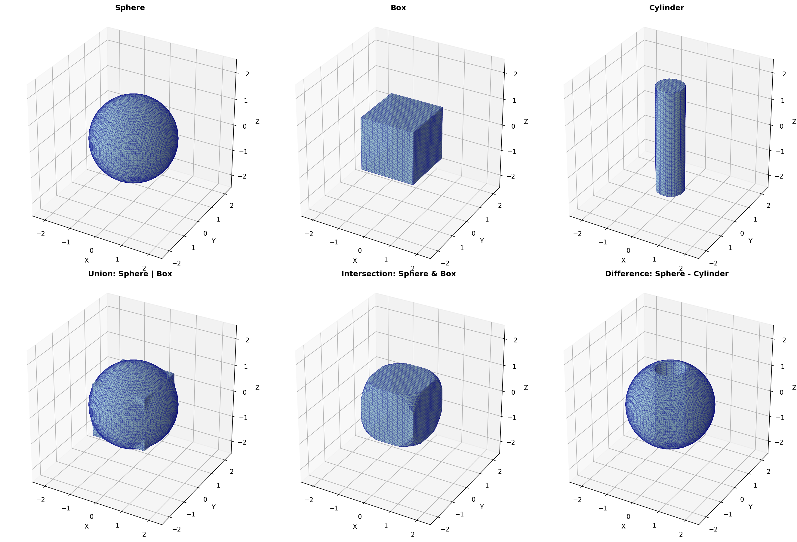
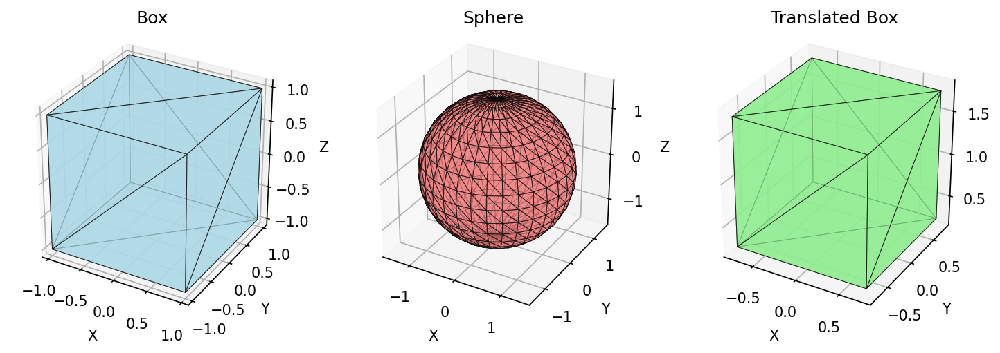
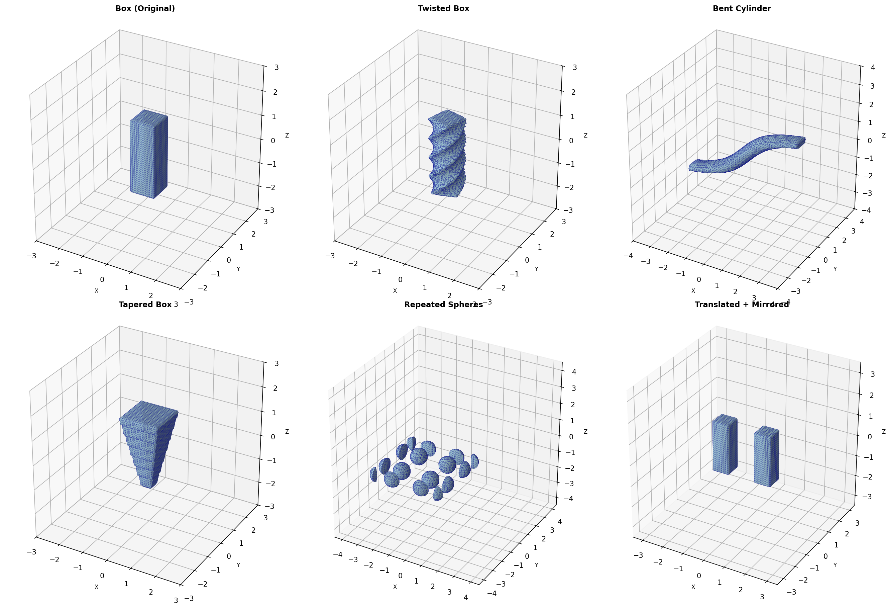

# JaxCAD

> **⚠️ Experimental Project** - Currently exploratory and under active development.

Differentiable CAD operations using Signed Distance Functions (SDFs) and Constructive Solid Geometry (CSG) built with JAX.



## Approach

**SDF-based CSG**: All geometry is represented as signed distance functions, with boolean operations implemented as smooth min/max functions for full differentiability.

## Features

### Primitives
Sphere, box, cylinder, cone, torus, capsule (as SDF functions)



### Boolean Operations
Union, difference, intersection with smooth blending

### Transformations
Affine transforms (translate, rotate, scale) and complex deformations (twist, bend, taper, repeat, mirror)



## Quick Example

```python
from jaxcad.primitives import Sphere, Box, Cylinder

# Create primitives
sphere = Sphere(radius=1.5)
box = Box(size=[1.0, 1.0, 1.0])

# Boolean operations using intuitive operators
union = sphere | box              # Union
intersection = sphere & box        # Intersection
difference = sphere - Cylinder(0.5, 2.0)  # Difference

# Transformations with method chaining
transformed = (
    box
    .twist('z', strength=2.0)     # Twist around Z axis
    .translate([1.0, 0.0, 0.0])   # Move in X direction
    .mirror('x')                  # Mirror across YZ plane
)
```

## Installation

```bash
uv sync  # or: pip install -e .
```

## Examples

Generate visualizations:
```bash
JAX_PLATFORMS=cpu uv run python examples/primitives.py
JAX_PLATFORMS=cpu uv run python examples/boolean_operations.py
JAX_PLATFORMS=cpu uv run python examples/transforms.py
JAX_PLATFORMS=cpu uv run python examples/complex_transforms.py
```

## License

MIT License

Copyright (c) 2025 JaxCAD Contributors

Permission is hereby granted, free of charge, to any person obtaining a copy
of this software and associated documentation files (the "Software"), to deal
in the Software without restriction, including without limitation the rights
to use, copy, modify, merge, publish, distribute, sublicense, and/or sell
copies of the Software, and to permit persons to whom the Software is
furnished to do so, subject to the following conditions:

The above copyright notice and this permission notice shall be included in all
copies or substantial portions of the Software.

THE SOFTWARE IS PROVIDED "AS IS", WITHOUT WARRANTY OF ANY KIND, EXPRESS OR
IMPLIED, INCLUDING BUT NOT LIMITED TO THE WARRANTIES OF MERCHANTABILITY,
FITNESS FOR A PARTICULAR PURPOSE AND NONINFRINGEMENT. IN NO EVENT SHALL THE
AUTHORS OR COPYRIGHT HOLDERS BE LIABLE FOR ANY CLAIM, DAMAGES OR OTHER
LIABILITY, WHETHER IN AN ACTION OF CONTRACT, TORT OR OTHERWISE, ARISING FROM,
OUT OF OR IN CONNECTION WITH THE SOFTWARE OR THE USE OR OTHER DEALINGS IN THE
SOFTWARE.
