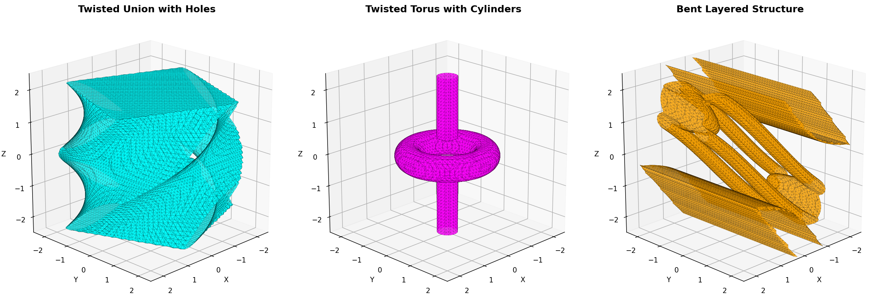

# JaxCAD

> **⚠️ Experimental Project** - Not a full CAD system. A fun exploration into differentiable geometry modeling with JAX. For now most of the code is vibe coded and very much a work in progress.

Differentiable signed distance functions (SDFs) for shape design and optimization. The goal is a simple, composable API for gradient-based geometry work.



## Key Features

- **Fluent API**: Build geometry with method chaining
- **Full Differentiability**: Every parameter can be optimized with JAX gradients
- **SDF-based CSG**: Smooth boolean operations using signed distance fields
- **Parameter System**: Mark parameters as free/fixed for optimization control

## Quick Start

```python
import jax.numpy as jnp
from jaxcad.primitives import Sphere, Box

# Build shapes with fluent API
sphere = Sphere(radius=1.0).translate([2, 0, 0])
box = Box(size=[1, 1, 1])

# Combine with boolean operators
shape = sphere | box  # Union
shape = sphere & box  # Intersection
shape = sphere - box  # Difference

# Evaluate signed distance at any point
point = jnp.array([0.5, 0.0, 0.0])
distance = shape(point)  # Returns SDF value
```

### Parametric Optimization

```python
import jax
from jaxcad.parametric import parametric

# Define parametric shape
@parametric
def my_shape():
    sphere = Sphere(radius=1.0)
    return sphere.translate([0.0, 0.0, 0.0])

# Optimize to make surface pass through target
params = my_shape.init_params()
target = jnp.array([2.5, 0.0, 0.0])

for _ in range(30):
    grad = jax.grad(lambda p: my_shape(p, target) ** 2)(params)
    params = jax.tree_util.tree_map(lambda p, g: p - 0.1 * g, params, grad)

# Result: sphere moves to target point!
```

## Parameters and Optimization

Control which values can be optimized during gradient descent:

**Raw values** (fixed by default):
```python
sphere = Sphere(radius=1.0)  # Fixed, won't change during optimization
```

**Free parameters** (can be optimized):
```python
from jaxcad.constraints import Scalar, Point
from jaxcad.parametric import parametric

radius = Scalar(value=1.0, free=True, name='radius')
position = Point(value=[0, 0, 0], free=True, name='pos')

@parametric
def shape():
    return Sphere(radius=radius).translate(position)

# Optimize with JAX gradients
params = shape.init_params()
# params = {'radius': 1.0, 'pos': [0, 0, 0]}
```

D**Parameter types**: `Scalar` (single values), `Point` (3D vectors). Aliases: `Distance`, `Angle`.

**Example: Optimize position, keep size fixed**

```python
import jax
import jax.numpy as jnp
from jaxcad.constraints import Scalar, Point
from jaxcad.primitives import Sphere
from jaxcad.parametric import parametric

# Design intent: sphere size is fixed, but position can be optimized
fixed_radius = Scalar(value=1.0, free=False)      # Cannot change
free_position = Point(value=[0, 0, 0], free=True)   # Can be optimized

@parametric
def constrained_design():
    sphere = Sphere(radius=fixed_radius)
    return sphere.translate(free_position)

# Optimize position to fit a target point, but radius stays 1.0
params = constrained_design.init_params()
target = jnp.array([3.0, 1.0, 0.0])

for _ in range(50):
    grad = jax.grad(lambda p: constrained_design(p, target) ** 2)(params)
    params = jax.tree_util.tree_map(lambda p, g: p - 0.1 * g, params, grad)

# Result: position optimized to [2.0, 1.0, 0.0], radius remains 1.0!
```

---

## Installation

```bash
uv sync  # or: pip install -e .
```

## Examples

```bash
# Start here
JAX_PLATFORMS=cpu uv run python examples/quickstart.py

# See all primitives
JAX_PLATFORMS=cpu uv run python examples/primitives.py

# Boolean operations with visualization
JAX_PLATFORMS=cpu uv run python examples/boolean_operations.py

# Advanced parametric optimization
JAX_PLATFORMS=cpu uv run python examples/decorator_api.py
```

## License

MIT License

Copyright (c) 2025 JaxCAD Contributors

Permission is hereby granted, free of charge, to any person obtaining a copy
of this software and associated documentation files (the "Software"), to deal
in the Software without restriction, including without limitation the rights
to use, copy, modify, merge, publish, distribute, sublicense, and/or sell
copies of the Software, and to permit persons to whom the Software is
furnished to do so, subject to the following conditions:

The above copyright notice and this permission notice shall be included in all
copies or substantial portions of the Software.

THE SOFTWARE IS PROVIDED "AS IS", WITHOUT WARRANTY OF ANY KIND, EXPRESS OR
IMPLIED, INCLUDING BUT NOT LIMITED TO THE WARRANTIES OF MERCHANTABILITY,
FITNESS FOR A PARTICULAR PURPOSE AND NONINFRINGEMENT. IN NO EVENT SHALL THE
AUTHORS OR COPYRIGHT HOLDERS BE LIABLE FOR ANY CLAIM, DAMAGES OR OTHER
LIABILITY, WHETHER IN AN ACTION OF CONTRACT, TORT OR OTHERWISE, ARISING FROM,
OUT OF OR IN CONNECTION WITH THE SOFTWARE OR THE USE OR OTHER DEALINGS IN THE
SOFTWARE.
