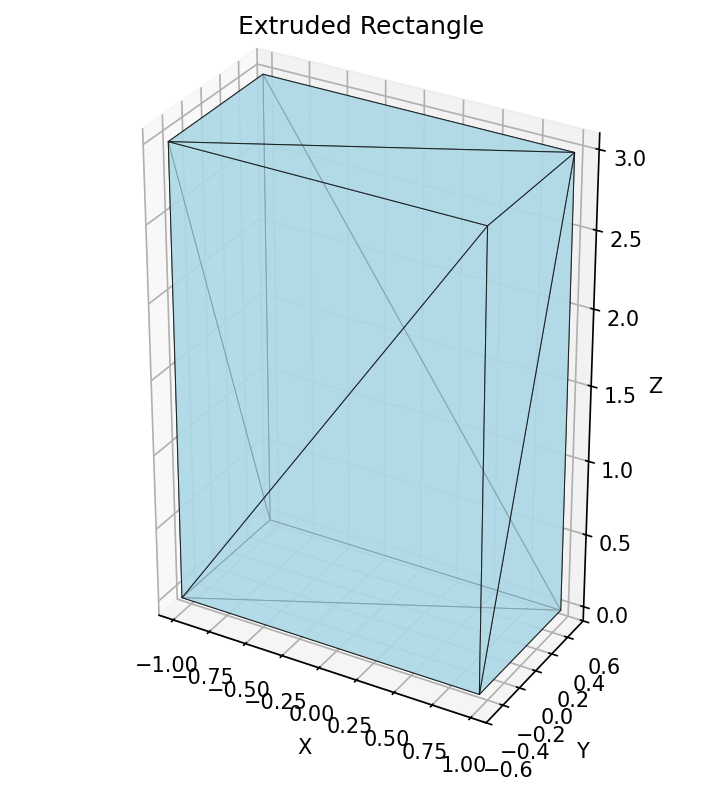
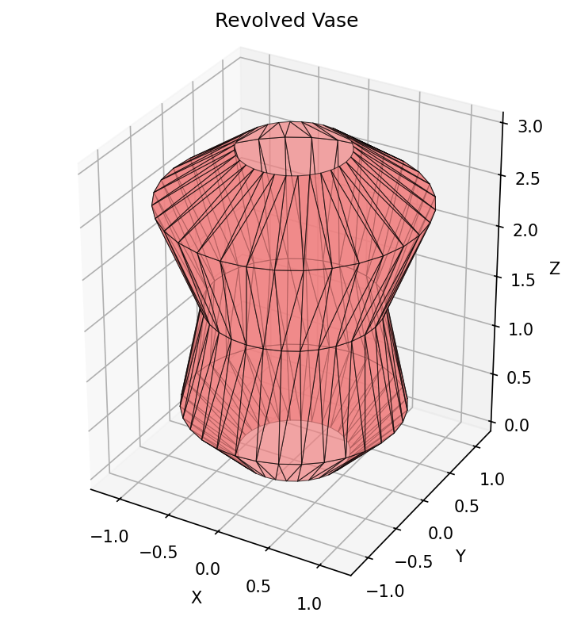
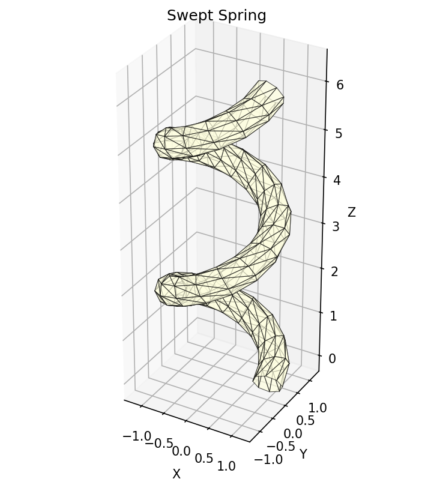
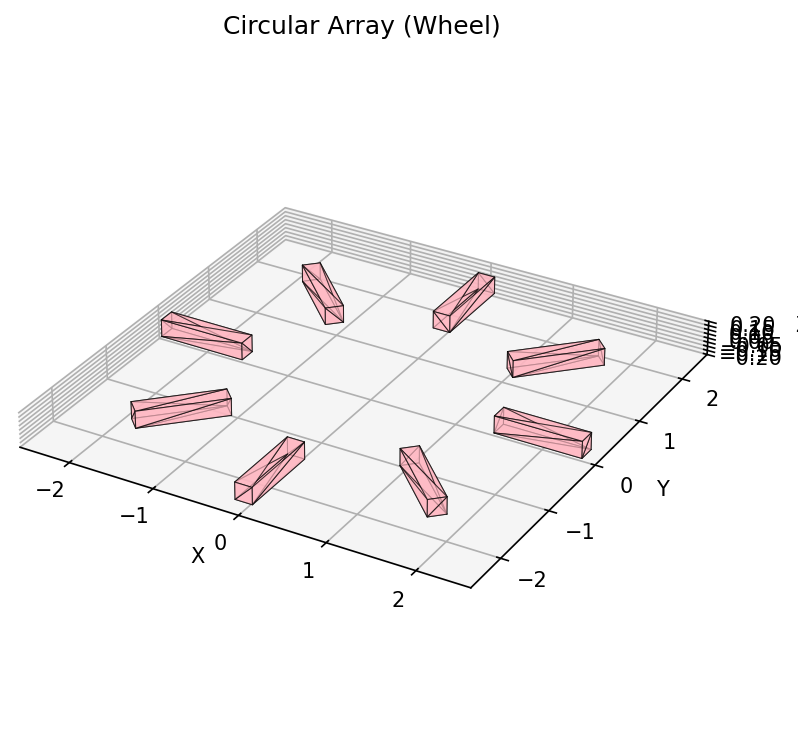
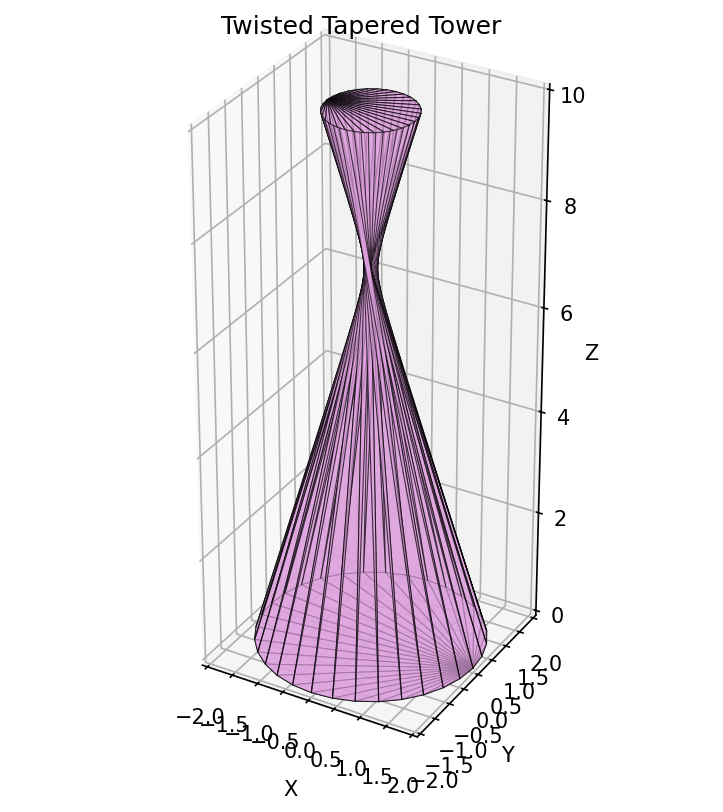

# JaxCAD

> **⚠️ Early Prototype** - This is an initial prototype exploring differentiable CAD operations with JAX.

Differentiable CAD primitives and operations built with JAX. Compute gradients through 3D geometry operations for gradient-based shape optimization.


## What it does

- **Differentiable primitives** (box, sphere, cylinder) and transformations (translate, rotate, scale)
- **2D sketch operations** (rectangle, circle, polygon) → **3D operations** (extrude, revolve, loft, sweep)
- **Gradient support** through all operations via JAX autodiff
- **Shape optimization** using gradient descent on geometric parameters

## Installation

```bash
uv sync  # or: pip install -e .
```

## Quick Example

```python
import jax
import jax.numpy as jnp
from jaxcad import box, extrude, rectangle, twist

# Create geometry
profile = rectangle(jnp.zeros(2), width=2.0, height=1.0)
solid = extrude(profile, height=3.0)
twisted = twist(solid, axis=jnp.array([0., 0., 1.]), angle=jnp.pi/2)

# Compute gradients
def volume(twist_angle):
    solid = extrude(profile, height=3.0)
    twisted = twist(solid, axis=jnp.array([0., 0., 1.]), angle=twist_angle)
    bbox = jnp.max(twisted.vertices, axis=0) - jnp.min(twisted.vertices, axis=0)
    return jnp.prod(bbox)

grad = jax.grad(volume)(jnp.pi/2)  # ∂(volume)/∂(angle)
```

## Examples

<table>
<tr>
<td width="33%"><br/><b>Extrude</b><br/>2D → 3D</td>
<td width="33%"><br/><b>Revolve</b><br/>Profile around axis</td>
<td width="33%"><br/><b>Sweep</b><br/>Profile along path</td>
</tr>
<tr>
<td width="33%"><br/><b>Array</b><br/>Circular pattern</td>
<td width="33%"><br/><b>Twist</b><br/>Deformation</td>
<td width="33%"><br/><b>Complex</b><br/>Combined operations</td>
</tr>
</table>

```bash
uv run python examples/basic_differentiability.py   # Gradients, Jacobians, Hessians
uv run python examples/optimization_example.py       # Gradient-based optimization
uv run python examples/complex_geometry.py           # All operations with viz
```

## Core Operations

**Primitives**: `box`, `sphere`, `cylinder`
**2D Sketch**: `rectangle`, `circle`, `polygon`, `regular_polygon`
**3D Operations**: `extrude`, `revolve`, `loft`, `sweep`
**Transformations**: `translate`, `rotate`, `scale`
**Modifications**: `twist`, `taper`, `thicken`
**Arrays**: `array_linear`, `array_circular`
**Mesh**: `merge`, `smooth_vertices`, `subdivide_faces`

## Implementation

- Mesh-based B-rep: vertices (N×3) and faces (M×3) as JAX arrays
- Pure functions compatible with `jax.grad`, `jax.vmap`, `jax.jit`
- 65 passing tests covering operations and gradients

## Testing & Linting

```bash
uv run pytest tests/ -v                              # Run tests
uv run ruff check jaxcad/ tests/ examples/ --fix    # Lint & format
```

## License

MIT License - See full text below.

---

MIT License

Copyright (c) 2025 JaxCAD Contributors

Permission is hereby granted, free of charge, to any person obtaining a copy
of this software and associated documentation files (the "Software"), to deal
in the Software without restriction, including without limitation the rights
to use, copy, modify, merge, publish, distribute, sublicense, and/or sell
copies of the Software, and to permit persons to whom the Software is
furnished to do so, subject to the following conditions:

The above copyright notice and this permission notice shall be included in all
copies or substantial portions of the Software.

THE SOFTWARE IS PROVIDED "AS IS", WITHOUT WARRANTY OF ANY KIND, EXPRESS OR
IMPLIED, INCLUDING BUT NOT LIMITED TO THE WARRANTIES OF MERCHANTABILITY,
FITNESS FOR A PARTICULAR PURPOSE AND NONINFRINGEMENT. IN NO EVENT SHALL THE
AUTHORS OR COPYRIGHT HOLDERS BE LIABLE FOR ANY CLAIM, DAMAGES OR OTHER
LIABILITY, WHETHER IN AN ACTION OF CONTRACT, TORT OR OTHERWISE, ARISING FROM,
OUT OF OR IN CONNECTION WITH THE SOFTWARE OR THE USE OR OTHER DEALINGS IN THE
SOFTWARE.
