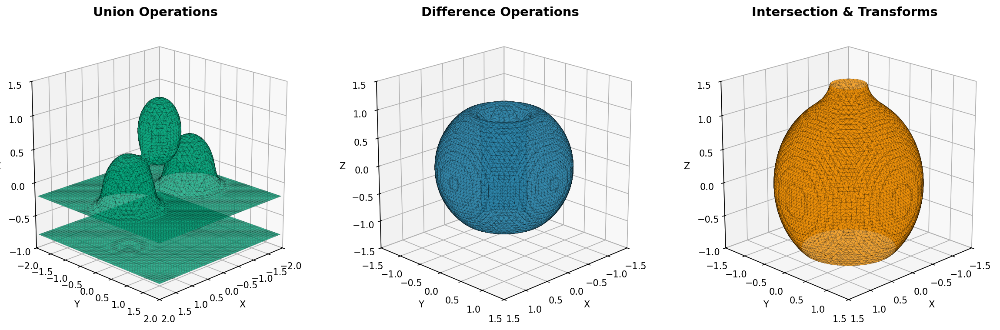
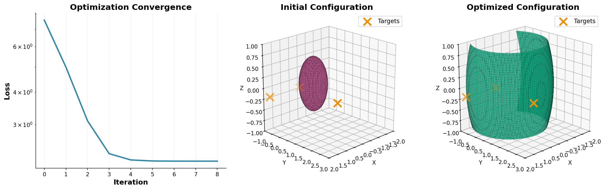

# jaxCAD

> **⚠️ Experimental Project** - Early development, collecting ideas and prototyping.

**Differentiable CAD** built on JAX and Signed Distance Functions (SDFs).

jaxCAD combines parametric geometry, geometric constraints, and automatic differentiation to enable gradient-based shape optimization with a clean, layered architecture.

## Quick Start

```python
import jax
import jax.numpy as jnp
from jaxcad.geometry.parameters import Vector, Scalar
from jaxcad.constraints import DistanceConstraint, ConstraintGraph
from jaxcad.construction import from_point
from jaxcad.compiler import compile_to_function

# Create parametric spheres with constraints
center1 = Vector([0.0, 0.0, 0.0], free=True, name='c1')
center2 = Vector([2.0, 0.0, 0.0], free=True, name='c2')

graph = ConstraintGraph()
graph.add_constraint(DistanceConstraint(center1, center2, distance=2.0))

# Build SDF scene
radius = Scalar(0.5, free=True, name='radius')
sphere1 = from_point(center1, radius)
sphere2 = from_point(center2, radius)
scene = sphere1 | sphere2  # Union

# Compile and optimize
sdf_fn = compile_to_function(scene)

def loss_fn(r):
    params = {'sphere_2.radius': r}
    target = jnp.array([0.8, 0.0, 0.0])
    dist = sdf_fn(target, params, {})
    return dist ** 2

grad_fn = jax.grad(loss_fn)
current_radius = 0.5
for step in range(8):
    gradient = grad_fn(current_radius)
    current_radius -= 0.1 * gradient

print(f"Optimized radius: {current_radius}")
```

## Examples

### Primitives and Transforms

3D rendering with marching cubes showing primitives, transforms, and boolean operations:

```bash
python examples/01_primitives_and_transforms.py
```



### End-to-End Optimization

Complete pipeline from parametric geometry to gradient-based optimization:

```bash
python examples/02_end_to_end_optimization.py
```



### Layered Construction

Full workflow demonstrating all layers working together:

```bash
python examples/layered_construction_demo.py
```

## Installation

```bash
git clone https://github.com/yourusername/jaxcad.git
cd jaxcad
uv sync  # or: pip install -e .
```

Requires: Python 3.10+, JAX, NumPy, Matplotlib, scikit-image

## Testing

```bash
# Run all tests (161 tests)
JAX_PLATFORMS=cpu uv run pytest tests/ -v

# Run by layer
pytest tests/geometry/       # 36 tests
pytest tests/constraints/    # 42 tests
pytest tests/construction/   # 23 tests
pytest tests/compiler/       # 10 tests
pytest tests/test_integration_e2e.py  # 9 tests
```

## Roadmap

- [x] Layered architecture (geometry, constraints, construction, compiler, SDF)
- [x] Parametric system with free/fixed parameters
- [x] Geometric constraints (distance, angle, parallel, perpendicular)
- [x] Construction functions (extrude, from_line, from_circle, from_point)
- [x] JAX compilation and automatic differentiation
- [x] 3D rendering with marching cubes
- [ ] Transform system fully integrated with construction
- [ ] More geometric primitives (Polygon, Bezier curves)
- [ ] Shader compilation (JAX → StableHLO → GLSL)
- [ ] Real-time GPU rendering
- [ ] Advanced constraints (tangent, coincident)
- [ ] Mesh export (STL, OBJ)

## Acknowledgments

Inspired by [Fidget](https://www.mattkeeter.com/projects/fidget/) by Matt Keeter and [Inigo Quilez's distance functions](https://iquilezles.org/articles/distfunctions/)

## License

MIT License - see LICENSE file for details