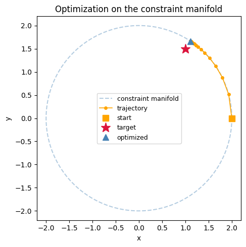

# jaxCAD

Differentiable SDF primitives, transformations, and constraint system built with JAX.

> [!WARNING]
> The API is not stable. Expect breaking changes.


---


## Development install

Clone this repo and
```bash
cd jaxcad
uv sync
```

## Tests

```bash
pytest tests/
```

## Docs

Requires [Quarto](https://quarto.org/docs/get-started/) and the `docs` extras:

```bash
pip install -e ".[docs]"
quartodoc build   # generate API reference from docstrings
quarto preview    # serve locally at localhost:4321
```

---

## Example

Pin a sphere's center to a constraint manifold and find the point on it closest to a target:

```python
import jax
import jax.numpy as jnp
from jaxcad.constraints import DistanceConstraint
from jaxcad.geometry import Vector
from jaxcad.sdf import Sphere, Translate

# Constrain the sphere center to lie on a sphere of radius 2
anchor = Vector(jnp.array([0.0, 0.0, 0.0]), free=False, name="anchor")
p = Vector(jnp.array([2.0, 0.0, 0.0]), free=True, name="p")
DistanceConstraint(p, anchor, 2.0)

scene = Translate(Sphere(radius=0.3), offset=p)
target = jnp.array([1.0, 1.5, 0.0])

# Gradient descent with projection back onto the constraint manifold
def obj(q):
    return jnp.sum((q - target) ** 2)

lr = 0.1
p_current = jnp.array([2.0, 0.0, 0.0])
for _ in range(50):
    grad = jax.grad(obj)(p_current)
    p_new = p_current - lr * grad
    p_current = 2.0 * p_new / jnp.linalg.norm(p_new)  # project back onto manifold

print(p_current)  # [1.109 1.664 0.] -- closest point on the sphere to target
```


---

Inspired by [Fidget](https://www.mattkeeter.com/projects/fidget/) and [Inigo Quilez's distance functions](https://iquilezles.org/articles/distfunctions/).
