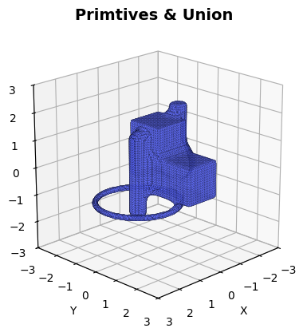

# jaxCAD



Differentiable CAD built on JAX and Signed Distance Functions.

Parametric geometry, geometric constraints, and automatic differentiation — composable with `jax.grad`, `jax.jit`, and `jax.vmap`.

---


## Development install

Clone this repo and
```bash
cd jaxcad
uv sync
```

## Tests

```bash
pytest tests/
```

## Docs

Requires [Quarto](https://quarto.org/docs/get-started/) and the `docs` extras:

```bash
pip install -e ".[docs]"
quartodoc build   # generate API reference from docstrings
quarto preview    # serve locally at localhost:4321
```

---

## Example

**Build a parametric scene and evaluate it:**

```python
import jax.numpy as jnp
from jaxcad.geometry.parameters import Scalar
from jaxcad.sdf.primitives import Sphere
from jaxcad import extract_parameters, functionalize

radius = Scalar(1.0, free=True, name='radius')
sphere = Sphere(radius=radius)

free_params, fixed_params = extract_parameters(sphere)
sdf_fn = functionalize(sphere)(free_params, fixed_params)

print(sdf_fn(jnp.array([0.0, 0.0, 0.0])))  # -1.0 (inside sphere)
```

**Differentiate through parameters:**

```python
import jax

def loss(r):
    target = jnp.array([2.0, 0.0, 0.0])
    return functionalize(sphere)({'sphere_0.radius': r}, {})(target) ** 2

print(jax.grad(loss)(1.0))
```

**Solve geometric constraints:**

```python
from jaxcad.geometry.parameters import Vector
from jaxcad.sdf.transforms import Translate
from jaxcad.constraints import DistanceConstraint, solve_constraints

p = Vector([0.5, 0.5, 0.0], free=True, name='p')
scene = Translate(Sphere(radius=0.5), offset=p)

anchor_a = Vector([0.0, 0.0, 0.0], free=False, name='a')
anchor_b = Vector([4.0, 0.0, 0.0], free=False, name='b')
anchor_c = Vector([2.0, 3.0, 0.0], free=False, name='c')

DistanceConstraint(p, anchor_a, 2.236)
DistanceConstraint(p, anchor_b, 2.236)
DistanceConstraint(p, anchor_c, 2.0)

solved = solve_constraints(scene)
```

---

Inspired by [Fidget](https://www.mattkeeter.com/projects/fidget/) and [Inigo Quilez's distance functions](https://iquilezles.org/articles/distfunctions/).
